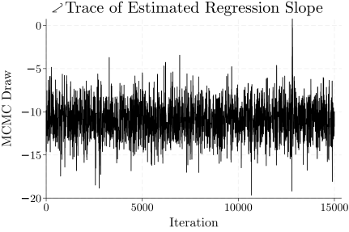

# Styling Stata graphics with LaTeX

This repository holds digital assets associated with the article "Styling Stata
graphics with LaTeX" [[1](#references)]. That article demonstrates using LaTeX
to style a plot produced with the Stata statistical software package. Generating
a Markov chain Monte Carlo (MCMC) traceplot for a water quality dataset, then
adding LaTeX glyphs, was used as an illustrative example.

---

<figure>
  <picture>
    <source media="(prefers-color-scheme: dark)" srcset="assets/water-quality-mcmc-traceplot-dm.svg">
    
  </picture>
   
  <figcaption>
    Figure 1. Stata MCMC traceplot for regression slope estimation in a water quality dataset.
    The plot is intended for LaTeX documents, and so uses a CMU Serif typeface, for visual harmony with LaTeX's default Computer Modern typeface.
    Also, the decorative glyph prepending the title, unavailable in Unicode or the Stata Markup and Control Language, was overlaid via LaTeX and Ti<i>k</i>Z.
    Adapted from Stenborg [<a href="#references">1</a>].</figcaption>
</figure>

---

## Table of Contents

- [Key Files](#key-files)
- [Software Requirements](#software-requirements)
- [Quality Assurance](#quality-assurance)
- [Getting Started](#getting-started)
- [Acknowledgements](#acknowledgements)
- [References](#references)

## Key Files

| File                    | Notes            |
| :---------------------- | :--------------- |
| `src/water-quality.csv` | CSV data (1 KB). |
| `src/water-quality.do`  | Stata script.    |
| `src/water-quality.tex` | LaTeX file.      |

## Software Requirements

| Software  | Notes                                                                                                                         |
| :-------- | :---------------------------------------------------------------------------------------------------------------------------- |
| Windows   | Supported operating system.                                                                                                   |
| CMU Serif | System font. Installation tips: [Windows 11](https://www.google.com/search?q=Installing+%22CMU+Serif%22+in+%22Windows+11%22). |
| Inkscape  | [Available here](https://inkscape.org). Free.                                                                                 |
| LaTeX     | [Available here](https://www.latex-project.org). Free.                                                                        |
| Stata     | [Available here](https://www.stata.com). Proprietary.                                                                         |

### LaTeX Configuration

Please ensure the LaTeX environment has the following packages installed:

- metsymb.
- standalone.
- tikz.

## Quality Assurance

The software has been tested with the following system configuration.

| Operating System                                                                        | Inkscape          | Stata                      |
| :-------------------------------------------------------------------------------------- | :---------------- | :------------------------- |
| Windows Server 2022 Datacenter &nbsp;&nbsp;&nbsp; Version 21H2 (OS Build 20348.5139) | v.1.4.3 &nbsp; | StataNow/SE 19.5 &nbsp; |

## Getting Started

### System Fonts

This software is designed to produce graphics for LaTeX documents. The Stata
script is intended for systems with the CMU Serif typeface installed. CMU Serif
is visually harmonious with LaTeX's default typeface, Computer Modern.

The Stata script will run on systems lacking the CMU Serif typeface. Default
typefaces will, however, be substituted in the generated graphics.

### Stata Graphics

The file `water-quality.do` should be run from Stata. That Stata script
performs Bayesian linear regression for a water quality dataset. When Stata
prompts for an input dataset, select the file `water-quality.csv`, supplied in
this repository.

A MCMC traceplot is exported in SVG format. If a local Inkscape installation is
available, a traceplot PDF file is also generated.

### LaTeX Styling

The traceplot PDF file may be styled further with LaTeX markup. Ensure the
traceplot and `water-quality.tex` files are in the same directory. Then,
compile `water-quality.tex` in a LaTeX environment. That will overlay a glyph
on the traceplot, beyond what's available in Unicode or the Stata Markup and
Control Language.

## Acknowledgements

This work was supported by the Australian Research Council Training Centre in
Data Analytics for Resources and Environments (project ICI9010031).

## References

1. Stenborg, T 2024, "Styling Stata graphics with LaTeX", TUGboat, vol. 45, no.
   3, pp. 374&ndash;375.\
   [View PDF](https://tug.org/TUGboat/tb45-3/tb141stenborg-stata.pdf) &nbsp;
   [View at publisher](https://doi.org/10.47397/tb/45-3/tb141stenborg-stata)
   &nbsp; [SciX](https://scixplorer.org/abs/2024TUGbt..45..374S/abstract)
